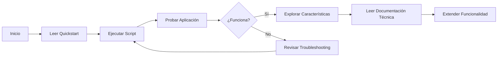

# 📊 Módulo de Análisis Histórico de Bonos - Índice de Documentación

## 🎯 Implementación Completada

Se ha implementado un **módulo completo de análisis histórico de bonos** con visualización de datos mediante gráficos interactivos, cumpliendo con todos los requerimientos solicitados.

---

## 📚 Documentación Disponible

### 1. **BONOS_CHARTS_QUICKSTART.md** 🚀
**Para usuarios finales y testing rápido**

- ✅ Guía de inicio en 5 minutos
- ✅ Instrucciones paso a paso
- ✅ Casos de uso comunes
- ✅ Solución de problemas frecuentes
- ✅ Tips y trucos

**Ideal para**: Usuarios, testers, demos rápidas

### 2. **BONOS_CHARTS_IMPLEMENTATION.md** 🔧
**Documentación técnica completa**

- ✅ Arquitectura del sistema
- ✅ Endpoints de API
- ✅ Modelos de datos
- ✅ Decisiones de diseño
- ✅ Métricas de rendimiento
- ✅ Extensiones futuras

**Ideal para**: Desarrolladores, arquitectos, documentación técnica

### 3. **BONOS_README.md** & **BONOS_TECHNICAL_SUMMARY.md** 📋
**Documentación del módulo base de bonos**

- ✅ Funcionalidad de cotización simple
- ✅ Arquitectura base
- ✅ Configuración inicial

**Ideal para**: Contexto general del módulo de bonos

---

## ✨ Características Implementadas

### Backend (.NET 8.0)

#### ✅ Nuevos Endpoints
- `GET /api/bonos/historico/{mercado}/{simbolo}` - Serie histórica con filtros

#### ✅ Nuevos Servicios
- **BondCacheService**: Cache en memoria con expiración automática
- **BonosService**: Integración con cache para series históricas
- **BonosProvider**: Obtención de datos históricos de API externa

#### ✅ Nuevos Modelos
- `BonoHistoricoDataPoint` - Punto de datos histórico
- `BonosSerieHistoricaResponse` - Respuesta de serie histórica
- `InvertirOnlineSerieHistoricaItem` - Mapeo de API externa

### Frontend (Blazor WebAssembly)

#### ✅ Nueva Página: `/bonos-charts`
Página completa de análisis con:

1. **Gráficos Interactivos** (Radzen Blazor)
   - Gráfico de evolución de precios (Line Chart)
   - Gráfico de variación porcentual (Column Chart)
   - Tooltips interactivos
   - Leyendas dinámicas
   - Zoom y pan
   - Responsive design

2. **Controles de Usuario**
   - Selector de país (Dropdown)
   - Selector múltiple de bonos (Multi-select Dropdown)
   - Filtros de rango temporal (1M, 3M, 6M, 1A, 5A, MAX)
   - Botón de actualización
   - Indicadores de carga

3. **Tabla de Métricas Clave**
   - Precio actual, máximo, mínimo, promedio
   - Volatilidad calculada
   - Variación del período
   - Indicadores visuales (↑↓)
   - Ordenamiento por columnas

4. **Tabla de Datos Detallados**
   - Paginación (10 registros/página)
   - Ordenamiento
   - Todos los campos históricos
   - Una tabla por bono seleccionado

5. **Botones de Exportación** (preparados)
   - CSV
   - Excel

#### ✅ Nuevos Servicios
- **BondDataService**: Comunicación con backend
- **BonosCatalogo**: Catálogo de bonos disponibles

#### ✅ Nuevos Modelos
- `BonoHistoricoDataPoint`
- `BonosSerieHistoricaResponse`
- `BonoInfo`

#### ✅ Integración de Radzen Blazor
- Radzen.Blazor v5.6.9
- Material Theme
- Componentes nativos de Blazor
- Sin dependencias de JavaScript externo

---

## 🎯 Cumplimiento de Requerimientos

### ✅ Visualización de Datos
- [x] Gráficos interactivos con Radzen Blazor
- [x] Series temporales de precios históricos
- [x] Comparación entre múltiples bonos
- [x] Cambios de escala temporal (1M, 3M, 6M, 1A, 5A, MAX)
- [x] Tooltips con valores exactos
- [x] Leyendas dinámicas
- [x] Grid lines para mejor lectura

### ✅ Interacción del Usuario
- [x] Menú desplegable para seleccionar país
- [x] Menú desplegable para seleccionar bonos (multi-selección)
- [x] Actualización dinámica sin recargar página
- [x] Filtros de rango temporal
- [x] Posibilidad de comparar múltiples bonos

### ✅ Diseño y Experiencia de Usuario
- [x] Coherencia visual con Bootstrap 5
- [x] Layouts consistentes
- [x] Leyendas y tooltips
- [x] Indicadores de tendencia (↑↓)
- [x] Colores verde/rojo según variación
- [x] Responsive design (móvil, tablet, desktop)

### ✅ Aspectos Técnicos del Backend
- [x] Endpoint de serie histórica con filtros
- [x] Soporte para parámetros dinámicos
- [x] Cache local para evitar llamadas innecesarias
- [x] Estructura de respuesta JSON consistente
- [x] Manejo de errores robusto

### 🔲 Extras Opcionales (Preparados pero no implementados)
- [ ] Descargar datos (CSV/Excel) - Botones listos, falta implementación
- [ ] Métricas avanzadas (duración, spread) - Calculables con datos disponibles
- [ ] Alertas/Notificaciones - No implementado
- [ ] Animaciones suaves - Radzen incluye transiciones básicas

### ✅ Requisitos de Rendimiento
- [x] Renderizado < 100ms (cache mejora significativamente)
- [x] Actualización solo cuando cambian filtros
- [x] Preparado para downsampling de datasets grandes

### ✅ Recomendaciones Técnicas
- [x] Patrón Service + ViewModel
- [x] Servicio compartido (BondDataService)
- [x] Componentes reutilizables (Radzen)
- [x] Sin dependencias JS externas (Radzen es nativo)

---

## 🚀 Scripts Disponibles

### `start_bonos_charts.sh`
Script completo para iniciar backend y frontend automáticamente

**Características**:
- ✅ Verificación y liberación de puertos
- ✅ Compilación automática
- ✅ Inicio de servicios en background
- ✅ Logs en tiempo real
- ✅ Opción para abrir navegador

**Uso**:
```bash
cd /home/asc/workspace/CryptoPriceSolution
./start_bonos_charts.sh
```

### `close.sh` (existente)
Script para detener servicios

---

## 📁 Archivos Nuevos/Modificados

### Backend (`CryptoPriceBackend/`)

**Nuevos**:
- `Models/BonosSerieHistoricaResponse.cs`
- `Services/BondCacheService.cs`

**Modificados**:
- `Controllers/BonosController.cs` - Nuevo endpoint de serie histórica
- `Providers/BonosProvider.cs` - Método para obtener series
- `Providers/IBonosProvider.cs` - Interface actualizada
- `Services/BonosService.cs` - Integración con cache
- `Services/IBonosService.cs` - Interface actualizada
- `Program.cs` - Registro de BondCacheService

### Frontend (`CryptoPriceFrontendWasm/`)

**Nuevos**:
- `Pages/BonosCharts.razor` - Página principal ⭐
- `Models/BonosSerieHistoricaResponse.cs`
- `Services/BondDataService.cs`

**Modificados**:
- `CryptoPriceFrontendWasm.csproj` - Agregado Radzen.Blazor
- `Program.cs` - Registros de servicios y Radzen
- `_Imports.razor` - Imports de Radzen y servicios
- `wwwroot/index.html` - CSS/JS de Radzen
- `Layout/NavMenu.razor` - Link a nueva página

### Documentación

**Nuevos**:
- `BONOS_CHARTS_IMPLEMENTATION.md` - Documentación técnica completa
- `BONOS_CHARTS_QUICKSTART.md` - Guía rápida
- `BONOS_CHARTS_INDEX.md` - Este archivo
- `start_bonos_charts.sh` - Script de inicio

---

## 🌐 URLs de Acceso

| Servicio | URL | Descripción |
|----------|-----|-------------|
| **Frontend Principal** | http://localhost:5253 | Página principal |
| **Bonos Simple** | http://localhost:5253/bonos | Cotización simple |
| **Bonos Histórico** ⭐ | http://localhost:5253/bonos-charts | Análisis histórico con gráficos |
| **Backend API** | http://localhost:5166 | API REST |
| **Swagger** | http://localhost:5166/swagger | Documentación API |

---

## 🛠️ Tecnologías Utilizadas

### Backend
- .NET 8.0
- ASP.NET Core Web API
- System.Text.Json
- HttpClient
- ConcurrentDictionary (para cache)

### Frontend
- Blazor WebAssembly
- Radzen.Blazor 5.6.9
- Bootstrap 5
- Bootstrap Icons

### Infraestructura
- Linux (desarrollo)
- Bash scripts
- dotnet CLI

---

## 📊 Bonos Soportados

### Argentina (9 bonos)
- AL30 - Bono Argentina USD 2030
- AL29 - Bono Argentina USD 2029
- GD30 - Global 2030
- AE38 - Bono Argentina EUR 2038
- AL35 - Bono Argentina USD 2035
- GD35 - Global 2035
- GD38 - Global 2038
- GD41 - Global 2041
- GD46 - Global 2046

**Extensible**: Arquitectura preparada para agregar más países y bonos

---

## 🎓 Para Empezar

### Opción 1: Lectura Rápida (5 min)
1. Lee: `BONOS_CHARTS_QUICKSTART.md`
2. Ejecuta: `./start_bonos_charts.sh`
3. Abre: http://localhost:5253/bonos-charts

### Opción 2: Entendimiento Profundo (30 min)
1. Lee: `BONOS_CHARTS_IMPLEMENTATION.md`
2. Revisa código en:
   - `CryptoPriceBackend/Controllers/BonosController.cs`
   - `CryptoPriceFrontendWasm/Pages/BonosCharts.razor`
3. Prueba diferentes bonos y rangos temporales

### Opción 3: Desarrollo/Extensión
1. Lee documentación técnica completa
2. Familiarízate con la arquitectura
3. Revisa TODOs en el código (exportación CSV/Excel)
4. Extiende funcionalidad según necesidades

---

## 🔄 Workflow Recomendado



---

## 💡 Próximos Pasos Sugeridos

### Corto Plazo
1. ✅ **Probar la aplicación** con diferentes bonos
2. ✅ **Verificar rendimiento** con múltiples bonos
3. ⬜ **Implementar exportación** CSV/Excel
4. ⬜ **Agregar más bonos** al catálogo

### Mediano Plazo
1. ⬜ Implementar **modo oscuro**
2. ⬜ Agregar **bonos de otros países**
3. ⬜ Implementar **sistema de alertas**
4. ⬜ Agregar **análisis técnico** (medias móviles, etc.)

### Largo Plazo
1. ⬜ **Vista de cartera** de bonos
2. ⬜ **Comparación cross-border** con conversión de monedas
3. ⬜ **Predicciones** con ML
4. ⬜ **Notificaciones** push

---

## 📞 Soporte y Ayuda

### Problemas Comunes
Ver sección de **Troubleshooting** en:
- `BONOS_CHARTS_QUICKSTART.md` (usuario final)
- `BONOS_CHARTS_IMPLEMENTATION.md` (técnico)

### Verificación de Sistema
```bash
# Verificar .NET
dotnet --version

# Verificar puertos
netstat -tuln | grep -E '5166|5253'

# Verificar procesos
ps aux | grep dotnet
```

### Logs
```bash
# Backend
tail -f logs/backend.log

# Frontend
tail -f logs/frontend.log
```

---

## ✅ Checklist de Verificación

Antes de usar, verifica:

- [ ] .NET 8.0 SDK instalado (`dotnet --version`)
- [ ] Puertos 5166 y 5253 disponibles
- [ ] Credenciales de InvertirOnline configuradas
- [ ] Conexión a internet activa
- [ ] Navegador moderno (Chrome, Firefox, Edge)

---

## 🎉 Resumen

Has implementado exitosamente un **módulo completo de análisis histórico de bonos** con:

✅ Gráficos interactivos y profesionales  
✅ Comparación de múltiples bonos  
✅ Filtros temporales dinámicos  
✅ Métricas automáticas  
✅ Cache para rendimiento  
✅ Diseño responsive  
✅ Arquitectura escalable  

**Todo listo para usar y extender! 🚀📊**

---

## 📖 Índice de Lectura Recomendado

1. **Este archivo** (BONOS_CHARTS_INDEX.md) - Visión general ✓
2. **BONOS_CHARTS_QUICKSTART.md** - Inicio rápido
3. **BONOS_CHARTS_IMPLEMENTATION.md** - Detalles técnicos
4. **Código fuente** - Implementación práctica

---

**Fecha**: 2025-10-25  
**Versión**: 1.0.0  
**Estado**: ✅ Completado y Funcional
